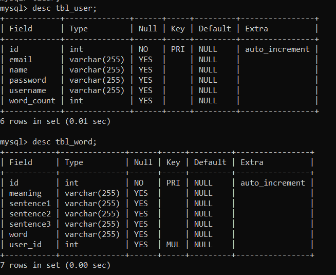

# wordly

Wordly is an application to store, update and delete English vocabularies 
that we come across while watching movies, listening podcast, reading books etc. 
It makes you feel likes its your own dictionary. 

***Tools used are :*** 
Language : Java 
Frontend : JSP, HTML, CSS  
Framework : Spring MVC  
Database server : MySQL 
Project Management tool : Maven 

***Project Overview*** 
User Register Page  

 
After the registration of the use, You are directed to the Login form.

 

Database contains two tables 
- tbl_user
- tbl_word

***User profile UI***

 

To update the user details  

As the application is about Creating our own vocabularies we need an add word page. 

List of all the user specific words and options to update and delete the specific word. 

To modify the word.

Search the word in your word dictonary. 

